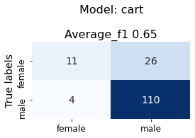

# TextAnalysis

Model Selection and Tuning for Gender Classification
This project aims to build and evaluate machine learning models for gender classification based on various classifiers. The models are built on a preprocessed dataset containing various features related to a user's profile.

# Results:

**Model Benchmark**

**confusion_matrix**
 
 
 
 
 
 
 
 
 

The model_selection.ipynb notebook can be run on a Jupyter Notebook environment. The notebook contains the following sections:

**Data Preprocessing:** The data is loaded and preprocessed 
**Model Building:** The models are built using the get_models() function which initializes a dictionary of classifiers and a stacking ensemble of classifiers.
**Hyperparameter Tuning:** The find_best_params() function is used to find the best hyperparameters for each classifier using a grid search with cross-validation.
Model Evaluation: The evaluate_model() function is used to evaluate each model using cross-validation and different parameters.
Results: The results are displayed and analyzed.
Credits
This project was created by yoavlv.

**Dependencies**
The following packages are required to run the code:
scikit-learn
pandas
numpy
matplotlib
seaborn
